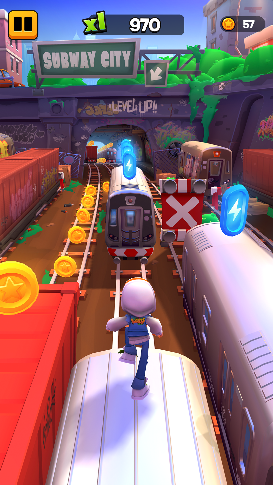
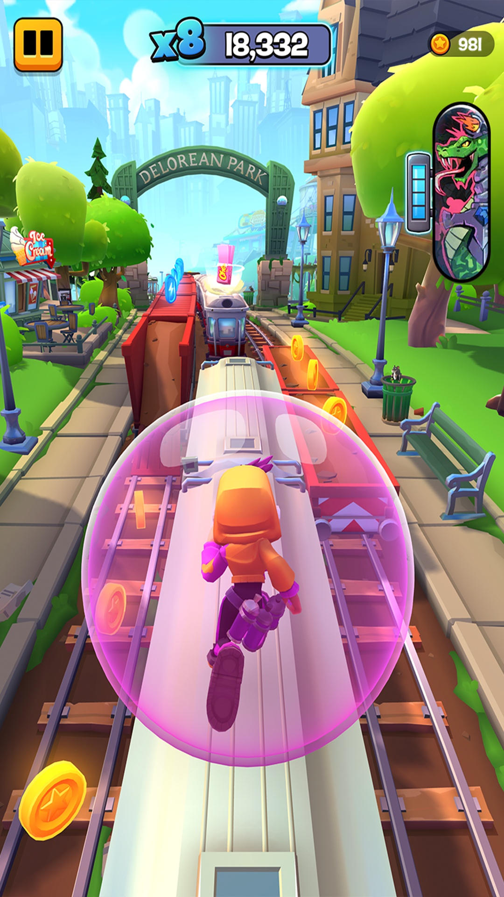
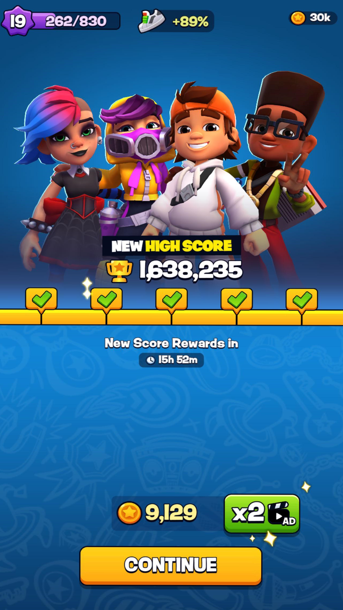
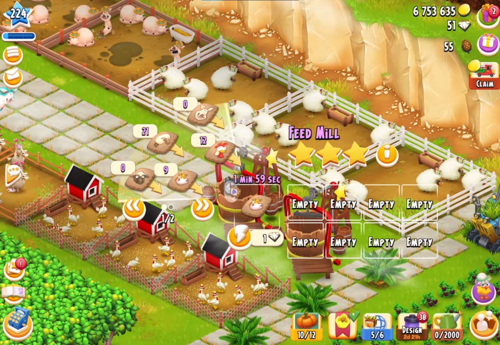
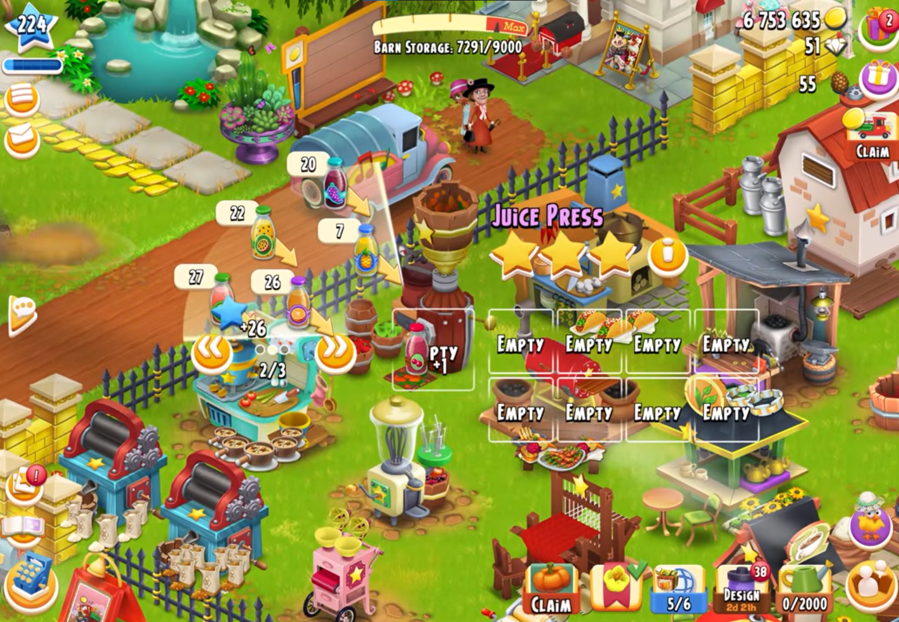
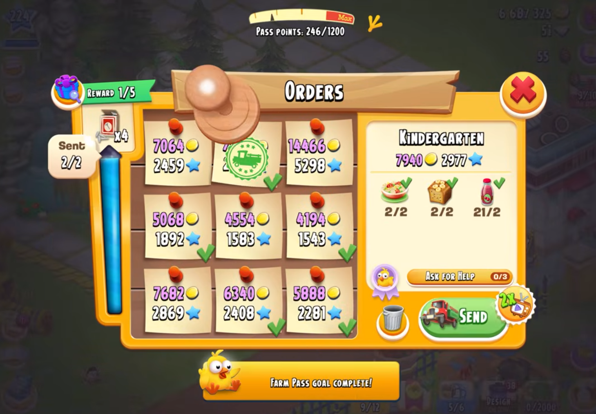

# CS464 Assignment 01 · Muhammad Hamza · BSSE23001

## Game 1 · Subway Surfers City

- **Google Play link:** [Subway Surfers City](https://play.google.com/store/apps/details?id=com.sybogames.subway.surfers.game&hl=en)
- **Genre:** Endless runner, Arcade / Platformer

| #   | Mechanic                                                                                                                                                  | Dynamic                                                                                                                                                                                             | Aesthetic                                                                                                                                                    | Bartle type  |
| --- | --------------------------------------------------------------------------------------------------------------------------------------------------------- | --------------------------------------------------------------------------------------------------------------------------------------------------------------------------------------------------- | ------------------------------------------------------------------------------------------------------------------------------------------------------------ | ------------ |
| M1  | The character continuously moves forward automatically, while we can switch between three lanes by swiping left or right.                                 | We can see any obstacle or powerup coming at a short distance which is why we can position ourself in that lane beforehand to avoid the obstacle or get the powerup.                                | **Challenge:** The player must react quickly to a continuously changing obstacle path, making successful movement an obstacle-solving task.                  | **Achiever** |
| M2  | Swiping up makes the character jump and swiping down makes the character roll; these actions allow us to avoid obstacles positioned at different heights. | Some obstacles are for jumping but have lower area of those obstacles is empty thats why we can also roll to pass those obstacles.                                                                  | **Challenge:** We must recognize obstacle patterns and select the correct movement before the collision occurs.                                              | **Achiever** |
| M3  | Coins placed along the running path can be collected by colliding with them.                                                                              | Most of the time the coin routes are difficult ones so while moving towards the coin, sometime costs us by our loss.                                                                                | **Discovery:** We can discover patterns and routes which allow us to get maximum coins while running long because at the end the patterns repeat themselves. | **Achiever** |
| M4  | Power-ups provide temporary effects, such as catching nearby coins via magnet, increasing movement speed or allowing us to collect double coins.          | Most of the powerups allow us to collide with obstacles at least once without loosing so we usually alter our routes to get that powerup in order to get its effect and one lifeline.               | **Challenge:** The temporary advantage changes the immediate decision space and encourages us to exploit the limited duration efficiently.                   | **Achiever** |
| M5  | Colliding with an obstacle ends the current run unless the player uses revival opportunity which costs an AD or keys.                                     | We have to become carefull as the run becomes longer because a single mistake can end accumulated progress at high speed.                                                                           | **Challenge:** The possibility of losing the run makes each obstacle a meaningful risk rather than a harmless interruption.                                  | **Achiever** |
| M6  | A run records a score based primarily on the distance travelled allowing successive runs to be compared.                                                  | We attempt to survive longer and improve our previous scores by repeating runs and once we score higher than the previous run we get a high score screen celebration even if we score 1 point more. | **Challenge:** We have a measurable performance target and can repeatedly attempt to improve their result.                                                   | **Achiever** |
| M7  | Coins and other earned resources can be spent on persistent upgradations such as character unlocking, upgrades etc.                                       | We usually save currency across runs and when an offer occurs we spend the coins to get more with less cost.                                                                                        | **Submission:** The persistent progression gives us a reason to return for short sessions and gradually build their collection.                              | **Achiever** |

**Aesthetic profile:**
**Challenge, Discovery and Submission** are the strongest aesthetics.

- **Challenge** is central because the player must continuously react to obstacles while speed and pressure increase during a run.
- **Discovery** comes from learning obstacle patterns, routes, power-up behavior and more effective ways to combine movement with collection.
- **Submission** comes from short repeatable runs and persistent progression, allowing the game to function as a quick pastime that can be played repeatedly.

**Player types**

- **Achiever**, because the core loop is focused on improving performance against the game's systems. M1, M2 and M6 require the player to impose actions on the game world to survive longer, avoid obstacles and improve scores.

---

## Game 2 · Hay Day

- **Store link:** [Hay Day](https://play.google.com/store/apps/details?id=com.supercell.hayday)
- **Genre:** Farming, Management, Simulation and Casual

| #   | Mechanic                                                                                                                                                   | Dynamic                                                                                                                                                                                                                                                              | Aesthetic                                                                                                                                                                 | Bartle type    |
| --- | ---------------------------------------------------------------------------------------------------------------------------------------------------------- | -------------------------------------------------------------------------------------------------------------------------------------------------------------------------------------------------------------------------------------------------------------------- | ------------------------------------------------------------------------------------------------------------------------------------------------------------------------- | -------------- |
| M1  | A crop plot can be planted with a crop seed, and after the crop's growth period it can be harvested to obtain a quantity of that crop.                     | We usually plant available seeds before doing anything else because it takes some time to grow and while we keep doing other tasks some of the crops usually have grown by then which gives us more material at the end to start more upgrades and plant more seeds. | **Submission:** We usually end up performing a simple repeating routine of planting, doing other tasks and harvesting in short sessions and then repeating for some time. | **Achiever**   |
| M2  | Harvested crops become resources that can be stored and used as inputs for other activities rather than being immediately consumed.                        | We decide whether to keep resources for future production or use them to satisfy current orders.                                                                                                                                                                     | **Challenge:** Limited resources create small planning problems because using one resource now can affect which tasks can be completed later.                             | **Achiever**   |
| M3  | Production buildings convert specific input resources into different finished goods, with each production action requiring resources and time.             | We usually queue useful goods and organize production around the resources and orders currently available for now.                                                                                                                                                   | **Challenge:** We must think about multiple production requirements and decide what should be produced first.                                                             | **Achiever**   |
| M4  | Production and other farm activities can require really long waiting before the resulting goods become available.                                          | We usually start timed activities and return later to collect the completed goods, often starting another production task immediately afterward.                                                                                                                     | **Submission:** Waiting periods turn the game into a background pastime that can be checked periodically throughout the day.                                              | **Achiever**   |
| M5  | Completed goods and resources can be sold through systems such as truck orders or the roadside shop in exchange for coins and other progression resources. | We compare available goods with current demands and choose which items to sell or use to obtain the resources we need.                                                                                                                                               | **Challenge:** We must manage supply and demand while deciding which resources provide the most useful return.                                                            | **Achiever**   |
| M6  | Completing farming, production and order activities awards experience, which unlocks additional content as our level increases.                            | We prioritize activities that provide useful rewards while working toward the next level and its newly available buildings or items.                                                                                                                                 | **Discovery:** Level progression gradually reveals additional systems, products and areas for the player to interact with.                                                | **Achiever**   |
| M7  | We can interact with other neighborhood systems to exchange resources, provide help and participate in shared activities such as neighborhood events.      | We request or provide assistance and coordinate resource use with other players rather than managing the farm completely in isolation.                                                                                                                               | **Fellowship:** Other players become part of the farming system through cooperation, assistance and shared objectives.                                                    | **Socializer** |

**Aesthetic profile:**
**Submission, Challenge and Fellowship** are the strongest aesthetics.

- **Submission** is particularly important because farming and production continue through timed activities, encouraging players to return periodically, collect completed goods and start another task.
- **Challenge** comes from managing limited resources, production requirements, orders and available time.
- **Fellowship** appears through interactions with neighbors and other players, where resources and assistance can be exchanged.

**Player types**

- **Primary: Achiever**, because most of the game's progression comes from directly managing the farm system: planting crops, producing goods, completing orders, earning currency and unlocking additional content.
- **Secondary: Socializer**, because M7 introduces other players as part of the gameplay system through helping, trading and neighborhood activities. The player's interaction with other people becomes useful to farm progression rather than being purely decorative.
